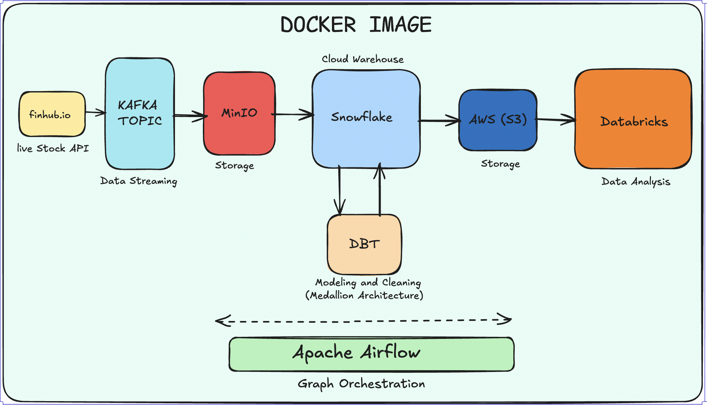

# Data-Engineering-Stock-Project
# 📈 Real-Time Financial Data Lakehouse: End-to-End Engineering Pipeline

  

## Executive Summary
This project implements a scalable **Event-Driven Data Pipeline** designed to ingest, process, and analyze live stock market data. It leverages a **Hybrid Cloud** approach (MinIO + AWS) and follows the **Medallion Architecture** to transform raw event streams into high-value analytical assets. 

The entire infrastructure is **Containerized** and **Orchestrated**, simulating a production-grade DevOps environment.

---

##  Technical Deep Dive

###  Ingestion & Streaming Layer (The Entry Point)
* **Finnhub.io API:** Serves as the high-frequency data source for live stock prices.
* **Apache Kafka:** Acts as the distributed message broker.
    * *Implementation:* Using Kafka Topics to decouple the producer (API) from the consumer (Storage), ensuring the system can handle bursts in market volatility without crashing.
* **MinIO (Landing Zone):** An S3-compatible object store used for local development to simulate a Cloud Data Lake. It captures the raw JSON payloads from Kafka.

###  Warehouse & Transformation Layer (The Brain)
* **Snowflake:** Chosen as the Cloud Data Warehouse for its separation of storage and compute.
* **dbt (Data Build Tool):** Manages the **SQL-based transformations** within Snowflake.
    * **Medallion Architecture Implementation:**
        1.  **Bronze (Ods):** Ingests raw data from MinIO using Snowflake Stages.
        2.  **Silver (Refined):** Applies data cleaning, casting, and de-duplication.
        3.  **Gold (Analytics):** Business-ready tables (e.g., 5-minute OHLC intervals, Volatility Indices).
* **Data Testing:** Integrated dbt tests to ensure `NOT NULL` and `UNIQUE` constraints at the Silver layer.

###  Analytics & AI Layer (The Output)
* **AWS S3:** Acts as the persistent storage layer for processed "Gold" data, making it accessible to external compute engines.
* **Databricks:** Utilizes **Apache Spark** for large-scale distributed processing. 
    * *Use Case:* Performing advanced time-series analysis and predictive modeling on the refined stock data.

###  DevOps & Orchestration (The Backbone)
* **Apache Airflow:** Manages the **DAG (Directed Acyclic Graph)**.
    * *Sensors:* Airflow waits for files to land in MinIO before triggering Snowflake tasks.
    * *Operators:* Custom Python and dbt operators to manage task dependencies.
* **Docker:** Every component (Kafka, Airflow, dbt) is containerized for **Environment Consistency**, ensuring "it works on my machine" translates to the cloud.

---

##  Pipeline Flow Logic

| Phase | Tool | Responsibility |
| :--- | :--- | :--- |
| **Extract** | Finnhub + Kafka | Real-time event capture and buffering |
| **Load** | MinIO -> Snowflake | Moving semi-structured JSON to structured tables |
| **Transform** | dbt | Applying the Medallion Architecture (Bronze-Silver-Gold) |
| **Orchestrate** | Airflow | Scheduling, retries, and failure alerts |
| **Analyze** | Databricks | Large-scale Spark SQL and ML modeling |

---
